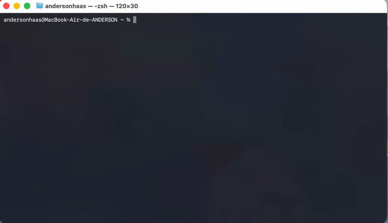

# ⚡ switch-llm

Gerenciador interativo de providers de LLM para o **Claude Code**. Troque entre diferentes provedores de IA (GLM, DeepSeek, MiniMax, OpenRouter e outros) diretamente pelo terminal, sem precisar editar arquivos manualmente.

---

## 🎥 Demo



> Vídeo completo: [demo.mp4](https://github.com/AndersonHaas/switch-llm/raw/main/demo.mp4)

---

## ✨ Funcionalidades

- Menu interativo com navegação por setas no terminal
- Troca de provider com um clique — reinicie o Claude Code para aplicar
- Gerenciador de modelos para o OpenRouter (adicionar, editar, excluir)
- Restauração rápida para as configurações originais do Claude Code
- Validação de JSON antes de aplicar qualquer configuração
- Não armazena suas API keys — cada usuário configura as suas

---

## 📦 Instalação

### macOS / Linux

```bash
git clone https://github.com/AndersonHaas/switch-llm.git
cd switch-llm
bash install.sh
```

Abra um novo terminal e teste:

```bash
provider
```

### Windows

```powershell
git clone https://github.com/AndersonHaas/switch-llm.git
cd switch-llm
.\install.ps1
```

> **Requisito:** Python 3.8 ou superior instalado e disponível no PATH.

---

## 🚀 Como usar

Digite `provider` no terminal para abrir o menu:

```
  ⚡ Provider Manager — Claude Code
  Ativo: Claude (Autenticado)
  ─────────────────────────────────────

  Claude (Autenticado) ✓
  deepseek
  glm
  minimax-api
  minimax-token
  openrouter  ▸
  ───────────────────────────────────
  + Novo provider
  ✎ Editar provider
  ✗ Excluir provider
  ↩ Restaurar original
  ✕ Sair

  ↑↓ navegar   Enter confirmar   q sair
```

| Tecla | Ação |
|-------|------|
| `↑` `↓` | Navegar pelos itens |
| `Enter` | Selecionar / confirmar |
| `q` | Sair / voltar |

### Comandos diretos (sem abrir o menu)

```bash
provider glm              # ativa o GLM
provider deepseek         # ativa o DeepSeek
provider list             # lista todos os providers
provider current          # mostra o provider ativo
provider edit deepseek    # edita as configurações do DeepSeek
provider reset            # restaura o Claude Code original
```

---

## 🔑 Configurando suas API keys

Após instalar, edite cada provider para adicionar sua chave:

```bash
provider edit glm
provider edit deepseek
provider edit minimax-api
provider edit minimax-token
provider edit openrouter
```

Cada arquivo tem este formato — preencha `ANTHROPIC_AUTH_TOKEN` com sua chave:

```json
{
  "env": {
    "ANTHROPIC_BASE_URL": "https://api.exemplo.com/anthropic",
    "ANTHROPIC_AUTH_TOKEN": "SUA_CHAVE_AQUI",
    "ANTHROPIC_API_KEY": "",
    "ANTHROPIC_MODEL": "nome-do-modelo"
  }
}
```

---

## 🌐 Providers incluídos

| Provider | URL base | Modelos padrão |
|----------|----------|----------------|
| **GLM** (Z.AI) | `https://api.z.ai/api/anthropic` | glm-5.2, glm-4.5-air |
| **DeepSeek** | `https://api.deepseek.com/anthropic` | deepseek-v4-pro, deepseek-v4-flash |
| **MiniMax API** | `https://api.minimax.io/anthropic` | MiniMax-M3, MiniMax-M2.7-highspeed |
| **MiniMax Token** | `https://api.minimax.io/anthropic` | MiniMax-M3, MiniMax-M2.7-highspeed |
| **OpenRouter** | `https://openrouter.ai/api` | qualquer modelo do OpenRouter |

### OpenRouter — gerenciando modelos

O OpenRouter dá acesso a centenas de modelos. No menu, selecione **openrouter ▸** para:

- Escolher um modelo salvo
- **+ Adicionar modelo** — cole o ID do modelo (ex: `deepseek/deepseek-chat`) e o apelido é gerado automaticamente
- **✎ Editar modelo** — atualizar o ID de um modelo
- **✗ Excluir modelo** — remover da lista

---

## ➕ Adicionando um novo provider

No menu, escolha **+ Novo provider**, digite o nome e preencha o arquivo que será aberto:

```json
{
  "env": {
    "ANTHROPIC_BASE_URL": "https://url-do-provider.com/anthropic",
    "ANTHROPIC_AUTH_TOKEN": "SUA_CHAVE",
    "ANTHROPIC_API_KEY": "",
    "API_TIMEOUT_MS": "3000000",
    "ANTHROPIC_MODEL": "nome-do-modelo",
    "ANTHROPIC_DEFAULT_SONNET_MODEL": "nome-do-modelo",
    "ANTHROPIC_DEFAULT_OPUS_MODEL": "nome-do-modelo",
    "ANTHROPIC_DEFAULT_HAIKU_MODEL": "nome-do-modelo-rapido"
  },
  "autoUpdatesChannel": "latest"
}
```

---

## 🔄 Atualizando

Para receber novos providers e modelos:

```bash
cd switch-llm
git pull
bash install.sh
```

---

## 📋 Requisitos

- Python 3.8+
- Claude Code instalado
- Terminal com suporte a cores (iTerm2, Terminal.app, Windows Terminal, etc.)

---

## 📄 Licença

MIT
